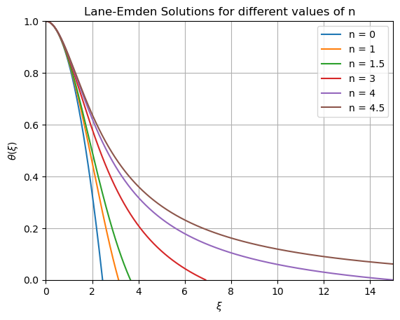
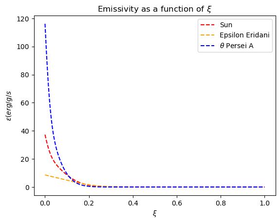
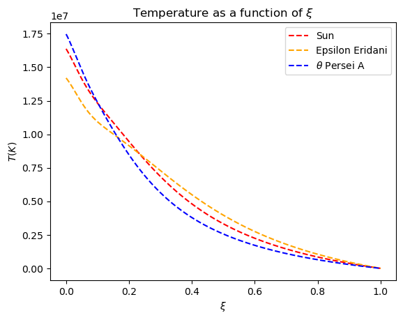
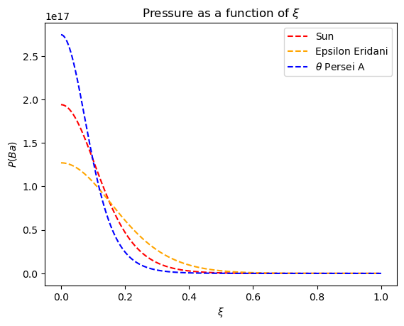
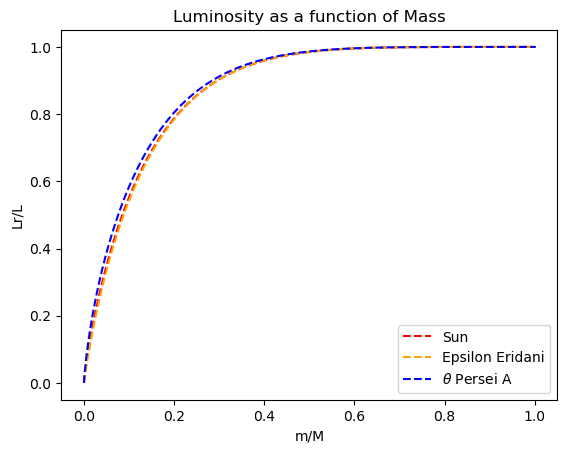

# <b> Computational_Astronomy </b>

Code for classes and 3 projects.

### <b> Project 1: Polytropic Indices </b> 

* Goal: Find the polytrope (of index n) that best models a real star, using the Lane-Emden equations, assuming that energy production occurs through hydrogen fusion in the core, and predict a star's density, pressure, luminosity and emmisivity throughout its radius relatively to the Sun.

* Stars used: Epsilon Eridani and Theta Persei A

* Tools: Python (NumPy, SciPy and MatPlotLib)

 

  
  
  
  
  

### <b> Project 2: Stellar Paremeters </b> 

* Goal: Predict stellar parameters based on an observed spectrum trough the comparison of multiple simulated spectra to find the best possible fit.

* Spectra used: 2 provided observed spectrums of 2 stars and hundreds of generated spectra based on [Pollux's database](https://pollux.oreme.org/).

* Tools: Python (NumPy, SciPy, Pandas and MatPlotLib)

